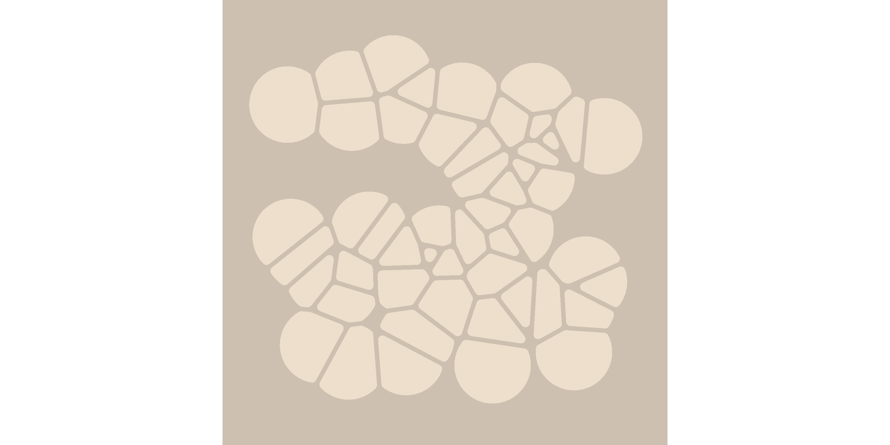

<!-- README.md is generated from README.Rmd. Please edit that file -->

# Voronoise

<!-- badges: start -->

<!-- badges: end -->

The goal of voronoise is to make pretty pictures. It is a very minor
tweak on the voronoi tesselations provided by the `ggforce` package. You
can install the development (only) version of voronoise from GitHub
with:

``` r
remotes::install_github("djnavarro/voronoise")
```

## Example

``` r
library(voronoise)
#> Loading required package: ggplot2
#> Loading required package: ggforce

set.seed(1)

shades <- function(n) {
  sample(colours(), size = n, replace = TRUE)
}

dat <- data.frame(
  x = runif(n = 50, min = .1, max = .9),
  y = runif(n = 50, min = .1, max = .9),
  cols_b = "antiquewhite2",
  cols_f = shades(50)
)

ggplot(dat, aes(x, y, group = 1)) + 
  geom_voronoi_tile(
    mapping = aes(fill = cols_b),
    show.legend = FALSE, 
    max.radius = .1,
    radius = .01, 
    expand = -.005
  ) + 
  geom_voronoi_tile(
    mapping = aes(fill = cols_f),
    stat = "voronoise_tile",
    show.legend = FALSE,
    max.radius = .1,
    radius = .01, 
    expand = -.005
  ) + 
  scale_fill_identity() +
  theme_mono("antiquewhite3") +
  coord_square()
```


