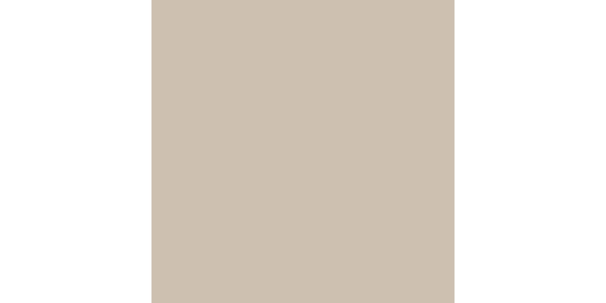
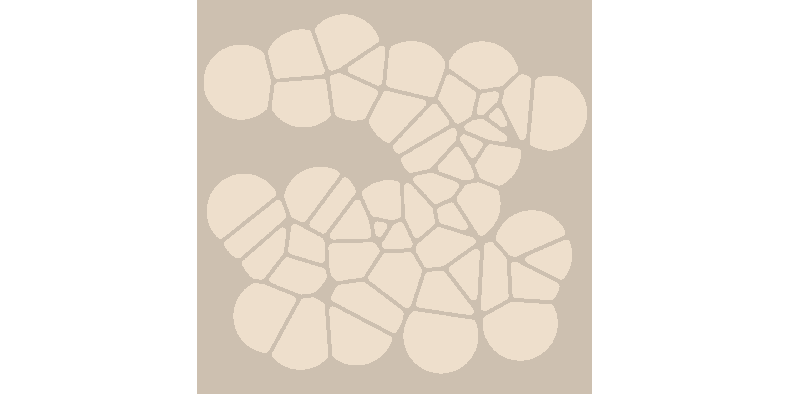
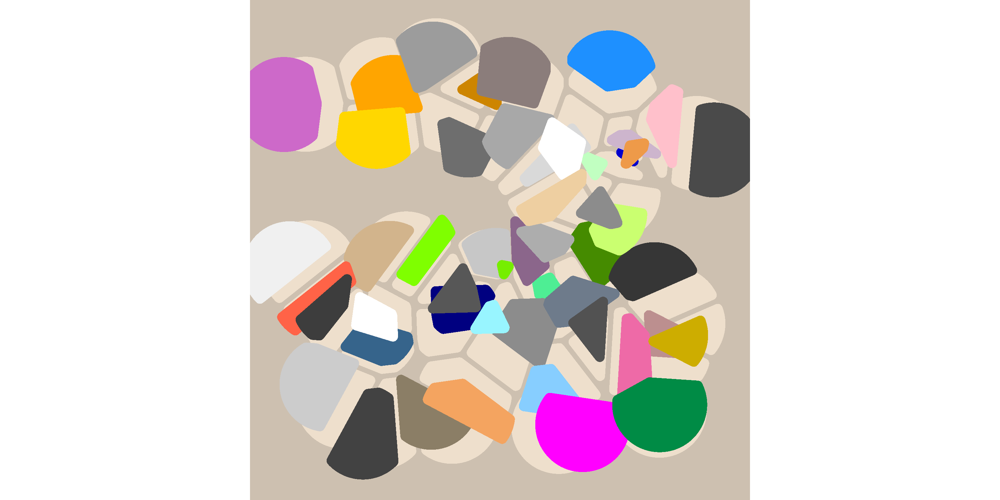
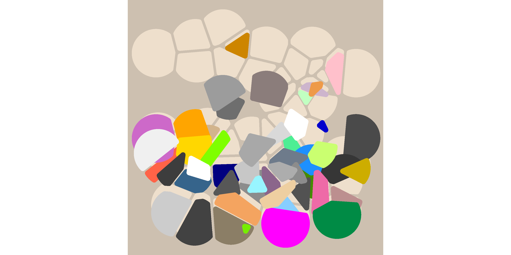
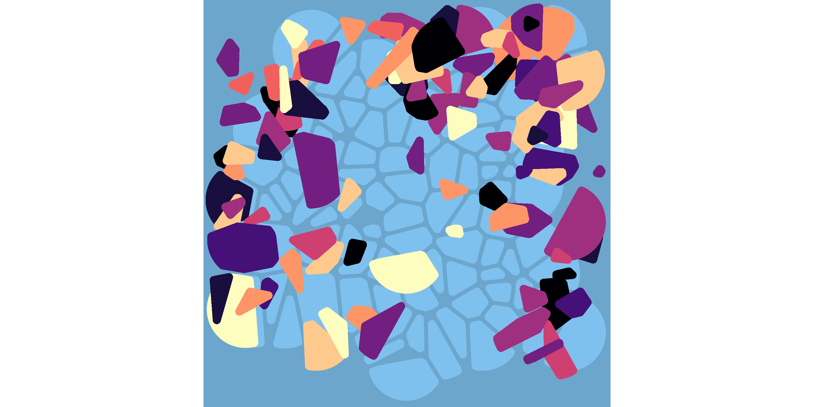

<!-- README.md is generated from README.Rmd. Please edit that file -->

# Voronoise

<!-- badges: start -->

<!-- badges: end -->

The goal of voronoise is to make pretty pictures. It is a very minor
tweak on the voronoi tesselations provided by the `ggforce` package. You
can install the development version of voronoise from GitHub with:

``` r
remotes::install_github("djnavarro/voronoise")
```

## Example

Create a tibble with columns specifying the x and y coordinates, and the
colours to be associated with the corresponding Voronoi cell

``` r
library(voronoise)
#> Loading required package: ggplot2
#> Loading required package: ggforce

set.seed(1)

dat <- tibble::tibble(
  x = runif(n = 50, min = .1, max = .9),
  y = runif(n = 50, min = .1, max = .9),
  shade = sample(colours(), size = 50, replace = TRUE)
)

dat
#> # A tibble: 50 x 3
#>        x     y shade       
#>    <dbl> <dbl> <chr>       
#>  1 0.312 0.482 tan         
#>  2 0.398 0.789 grey43      
#>  3 0.558 0.450 plum4       
#>  4 0.827 0.296 rosybrown   
#>  5 0.261 0.157 grey26      
#>  6 0.819 0.180 springgreen4
#>  7 0.856 0.353 gold3       
#>  8 0.629 0.515 grey68      
#>  9 0.603 0.630 navajowhite2
#> 10 0.149 0.425 tomato      
#> # … with 40 more rows
```

The `voronoise_base()` function initialises a ggplot object

``` r
voronoise_base(dat)
```



The default behaviour of `geom_voronoise()` is identical to
`ggforce::geom_voronoi_tile()` with some parameter values changed. It
does not perturb the location of any of the tiles:

``` r
voronoise_base(dat) + 
  geom_voronoise(fill = "antiquewhite2")
```



To perturb the tiles we need to pass it a `perturb` function:

``` r
voronoise_base(dat) + 
  geom_voronoise(fill = "antiquewhite2") + 
  geom_voronoise(perturb = perturb_uniform(.2))  
```



Note that `perturb_uniform()` returns a function. The voronoise package
comes with a couple of handy functions that will create custom
perturbing functions. For example:

``` r
voronoise_base(dat) + 
  geom_voronoise(fill = "antiquewhite2") + 
  geom_voronoise(perturb = perturb_float(-90))
```



An example using some more settings:

``` r
set.seed(1)
voronoise_base(
  data = voronoise_data(100, viridis::magma(10)), 
  background = "skyblue3"
) + 
  geom_voronoise(fill = "skyblue2") + 
  geom_voronoise(
    perturb = perturb_float(
      angles = c(0, 90, 180), 
      noise = c(2, 1)
    )
  )
```


