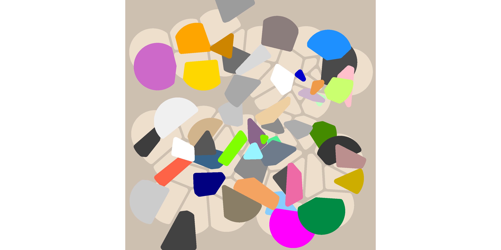
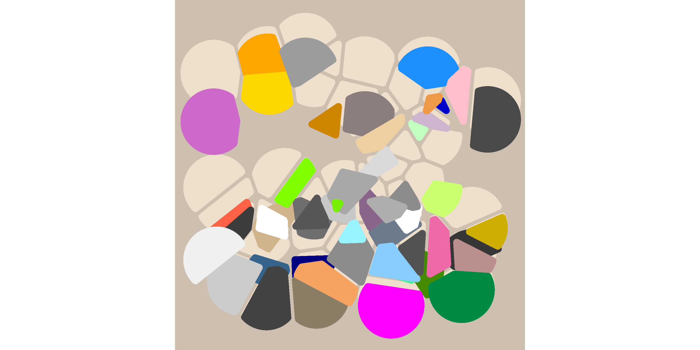

<!-- README.md is generated from README.Rmd. Please edit that file -->

# Voronoise

<!-- badges: start -->

<!-- badges: end -->

The goal of voronoise is to make pretty pictures. It is a very minor
tweak on the voronoi tesselations provided by the `ggforce` package. You
can install the development (only) version of voronoise from GitHub
with:

``` r
remotes::install_github("djnavarro/voronoise")
```

## Example

Create a tibble with columns specifying the x and y coordinates, and the
colours to be associated with the corresponding Voronoi cell

``` r
library(voronoise)
#> Loading required package: ggplot2
#> Loading required package: ggforce

set.seed(1)

dat <- tibble::tibble(
  x = runif(n = 50, min = .1, max = .9),
  y = runif(n = 50, min = .1, max = .9),
  shade = sample(colours(), size = 50, replace = TRUE)
)

dat
#> # A tibble: 50 x 3
#>        x     y shade       
#>    <dbl> <dbl> <chr>       
#>  1 0.312 0.482 tan         
#>  2 0.398 0.789 grey43      
#>  3 0.558 0.450 plum4       
#>  4 0.827 0.296 rosybrown   
#>  5 0.261 0.157 grey26      
#>  6 0.819 0.180 springgreen4
#>  7 0.856 0.353 gold3       
#>  8 0.629 0.515 grey68      
#>  9 0.603 0.630 navajowhite2
#> 10 0.149 0.425 tomato      
#> # … with 40 more rows
```

Set up a ggplot defined on the unit square, with an `"antiquewhite"`
background:

``` r
base <- ggplot(
  data = dat, 
  mapping = aes(x, y, fill = shade, group = 1)
) + 
  scale_fill_identity() +
  scale_x_continuous(expand = c(0, 0)) + 
  scale_y_continuous(expand = c(0, 0)) + 
  theme_mono("antiquewhite3") +
  coord_square()

base
```


The `base_plot()` function provides a convenient shorthand for the
above:

``` r
base_plot()
```


The default behaviour of `geom_voronoise()` is identical to
`ggforce::geom_voronoi_tile()` with some parameter values changed. It
does not perturb the location of any of the tiles:

``` r
base + 
  geom_voronoise(fill = "antiquewhite2")
```


To perturb the tiles we need to pass it a `perturb` function:

``` r
base + 
  geom_voronoise(fill = "antiquewhite2") + 
  geom_voronoise(
    mapping = aes(fill = shade), 
    perturb = perturb_uniform()
  )  
```



It’s not too hard to define whatever perturb function one would like:

``` r
library(dplyr)

perturb_fall <- function(data) {
  data %>% 
    group_by(group) %>% 
    mutate(
      y = y - rbeta(1, 3, 1) * min(y)
    ) %>% 
    ungroup()
}

base + 
  geom_voronoise(fill = "antiquewhite2") + 
  geom_voronoise(
    mapping = aes(fill = shade), 
    perturb = perturb_fall
  )  
```


The voronoise package comes with a couple of handy functions that will
create custom perturbing functions. So a more typical use might look
like this:

``` r
set.seed(1)
base_plot() + 
  geom_voronoise(fill = "antiquewhite2") + 
  geom_voronoise(perturb = perturb_float(-90))
```


